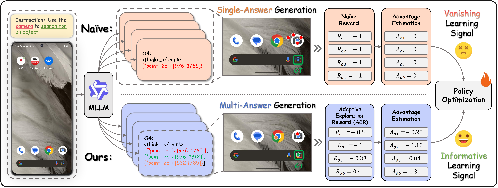
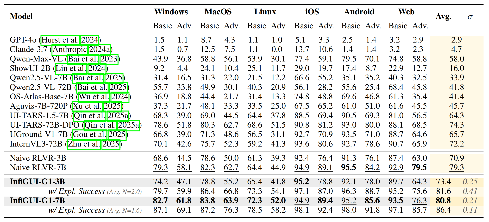
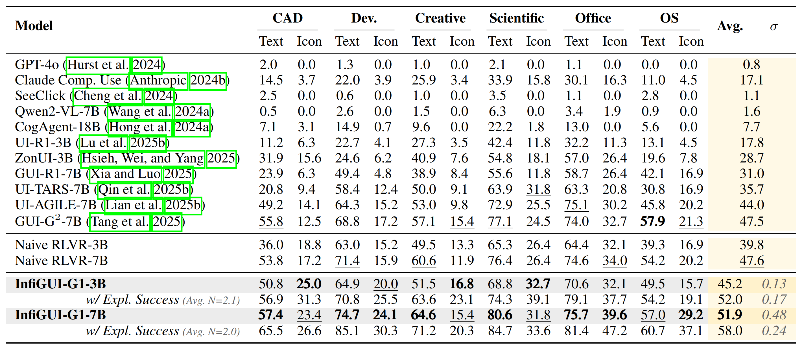
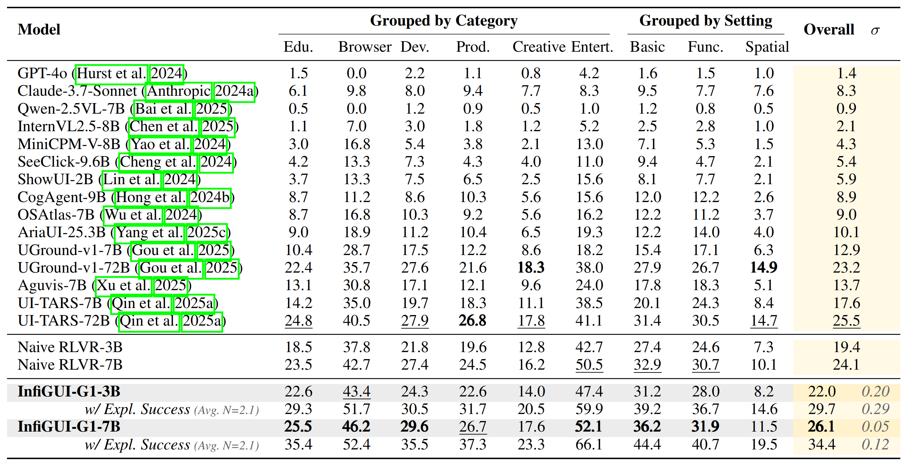
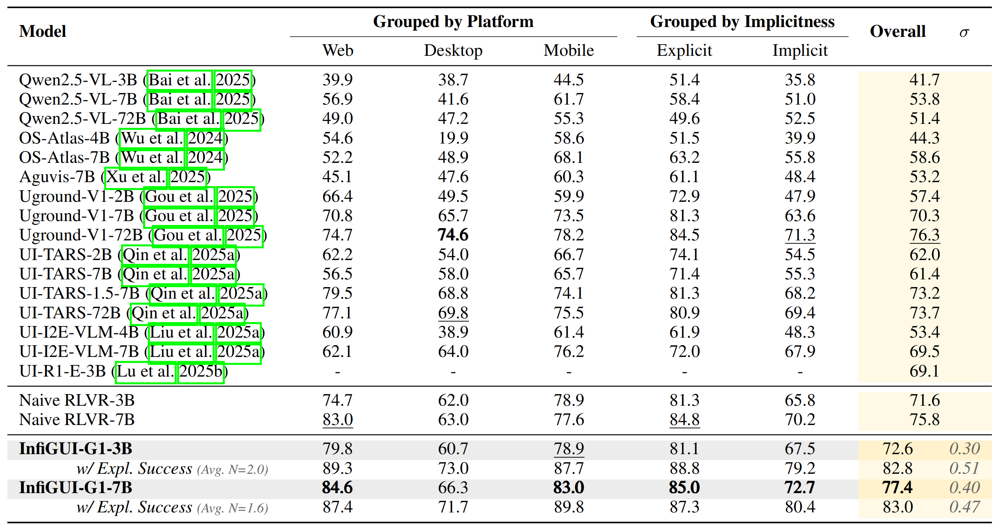
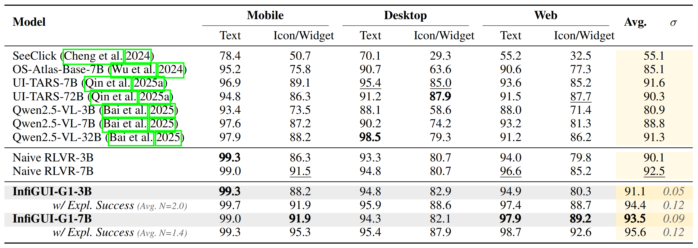

<h1 align="center">

<br>
InfiGUI-G1: Advancing GUI Grounding with Adaptive Exploration Policy Optimization
</h1>

<p align="center">
  <a href="https://github.com/InfiXAI/InfiGUI-R1"></a>
  <a href="https://github.com/InfiXAI/InfiGUI-R1"></a>
  <a href="https://github.com/InfiXAI/InfiGUI-R1"></a>
</p>

<br>
<p align="center">
  <strong>This is the official repository for the paper <a href="https://github.com/InfiXAI/InfiGUI-R1">InfiGUI-G1</a>.</strong>
</p>

## 🌟 Overview

A fundamental challenge for GUI agents is robustly grounding natural language instructions, which requires not only precise **spatial alignment** (locating elements accurately) but also correct **semantic alignment** (identifying the functionally appropriate element). While existing Reinforcement Learning with Verifiable Rewards (RLVR) methods have enhanced spatial precision, they often suffer from inefficient exploration. This "confidence trap" bottlenecks semantic alignment, preventing models from discovering correct actions for difficult semantic associations.

To address this critical exploration problem, we introduce **InfiGUI-G1**, a series of models trained with **Adaptive Exploration Policy Optimization (AEPO)**. AEPO overcomes the exploration bottleneck by integrating a **multi-answer generation** strategy to explore a diverse set of candidate actions in a single forward pass. This exploration is guided by a theoretically-grounded **Adaptive Exploration Reward (AER)** function, derived from first principles of efficiency ($\eta=U/C$), which provides rich, informative learning signals to dynamically balance exploration and exploitation.

<div align="center">
  
  <p><i>Comparison between a naive RL baseline and our AEPO framework. AEPO's multi-answer generation and adaptive reward mechanism break the exploration bottleneck, enabling robust semantic alignment by deriving an informative learning signal.</i></p>
</div>

## 🔥 News
- 🔥 ***`2025/08/08`*** Our paper "[InfiGUI-G1: Advancing GUI Grounding with Adaptive Exploration Policy Optimization](https://github.com/InfiXAI/InfiGUI-R1)" released.
- 🔥 ***`2025/05/15`*** Our paper "[OS Agents: A Survey on MLLM-based Agents for Computer, Phone and Browser Use](https://os-agent-survey.github.io/)" is accepted by *ACL 2025*.
- 🔥 ***`2025/4/19`*** Our paper "[InfiGUI-R1: Advancing Multimodal GUI Agents from Reactive Actors to Deliberative Reasoners](https://arxiv.org/abs/2504.14239)" released.
- 🔥 ***`2025/1/9`*** Our paper "[InfiGUIAgent: A Multimodal Generalist GUI Agent with Native Reasoning and Reflection](https://arxiv.org/abs/2501.04575)" released.
- 🔥 ***`2024/12/12`*** Our paper "[OS Agents: A Survey on MLLM-based Agents for Computer, Phone and Browser Use](https://os-agent-survey.github.io/)" released.
- ***`2024/4/2`*** Our paper "[InfiAgent-DABench: Evaluating Agents on Data Analysis Tasks](https://infiagent.github.io/)" is accepted by *ICML 2024*.

## 🚀 Updates

- ***`2025/08/08`*** The official repository for InfiGUI-G1 is now public.

## 📊 Results

Our InfiGUI-G1 models, trained with the AEPO framework, establish new state-of-the-art results among open-source models across a diverse and challenging set of GUI grounding benchmarks.

#### MMBench-GUI Results

On the comprehensive MMBench-GUI benchmark, which evaluates performance across various platforms and instruction complexities, our InfiGUI-G1 models establish new state-of-the-art results for open-source models in their respective size categories.

<div align="center">
  
</div>

#### ScreenSpot-Pro Results

On the challenging ScreenSpot-Pro benchmark, designed to test semantic understanding on high-resolution professional software, InfiGUI-G1 demonstrates significant improvements, particularly on icon-based grounding tasks. This highlights AEPO's effectiveness in enhancing semantic alignment by associating abstract visual symbols with their functions.

<div align="center">
  
</div>

#### UI-Vision Results

InfiGUI-G1 shows strong generalization capabilities on the UI-Vision benchmark, which is designed to test robustness across a wide variety of unseen desktop applications. Achieving high performance confirms that our AEPO framework fosters a robust understanding rather than overfitting to the training data.

<div align="center">
  
</div>

#### UI-I2E-Bench Results

To further probe semantic reasoning, we evaluated on UI-I2E-Bench, a benchmark featuring a high proportion of implicit instructions that require reasoning beyond direct text matching. Our model's strong performance underscores AEPO's ability to handle complex, indirect commands.

<div align="center">
  
</div>

#### ScreenSpot-V2 Results

On the widely-used ScreenSpot-V2 benchmark, which provides comprehensive coverage across mobile, desktop, and web platforms, InfiGUI-G1 consistently outperforms strong baselines, demonstrating the broad applicability and data efficiency of our approach.

<div align="center">
  
</div>

## 📚 Citation Information

If you find this work useful, citations to the following papers are welcome:

```bibtex
@article{liu2025infigui,
  title={InfiGUI-R1: Advancing Multimodal GUI Agents from Reactive Actors to Deliberative Reasoners},
  author={Liu, Yuhang and Li, Pengxiang and Xie, Congkai and Hu, Xavier and Han, Xiaotian and Zhang, Shengyu and Yang, Hongxia and Wu, Fei},
  journal={arXiv preprint arXiv:2504.14239},
  year={2025}
}
````

```bibtex
@article{liu2025infiguiagent,
  title={InfiGUIAgent: A Multimodal Generalist GUI Agent with Native Reasoning and Reflection},
  author={Liu, Yuhang and Li, Pengxiang and Wei, Zishu and Xie, Congkai and Hu, Xueyu and Xu, Xinchen and Zhang, Shengyu and Han, Xiaotian and Yang, Hongxia and Wu, Fei},
  journal={arXiv preprint arXiv:2501.04575},
  year={2025}
}
```

## 🙏 Acknowledgements

We would like to express our gratitude for the following open-source projects: [VERL](https://github.com/volcengine/verl) and [Qwen2.5-VL](https://github.com/QwenLM/Qwen2.5-VL).
